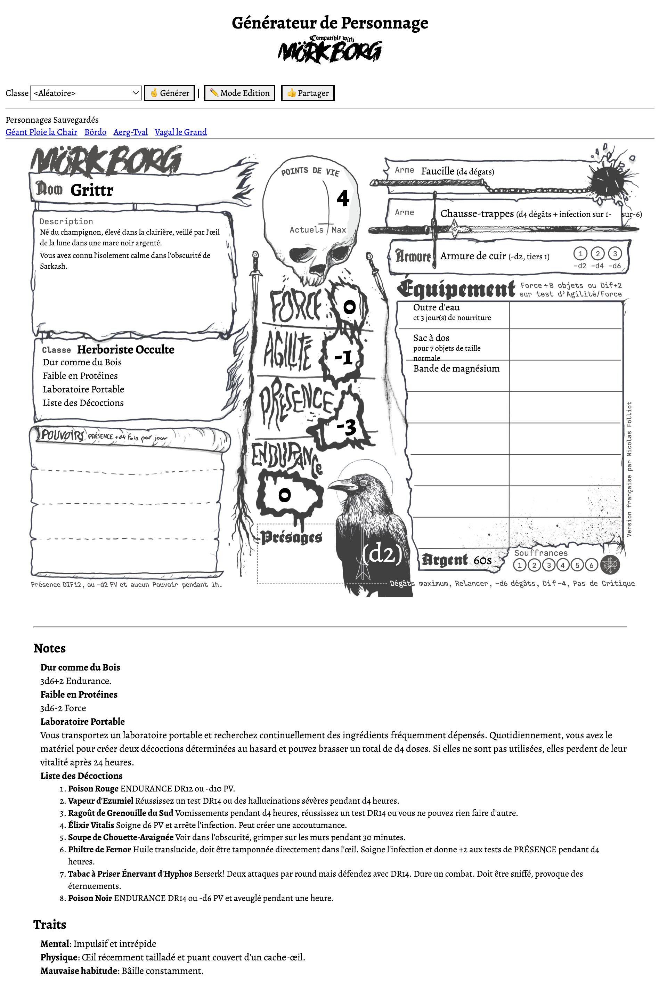

# MÖRK BORG - Générateur de Personnage

Un générateur de personnage pour le Jeu de Rôle <a href="https://morkborg.com/" target="_blank">MÖRK BORG</a> en français.
Ce générateur tourne dans un navigateur en pur HTML, CSS et Javascript.

## Utilisation

1. Lancez le <a href="https://fxnicolas.github.io/mork-borg-character-generator/mork-borg-character-generator.html" target="_blank">générateur</a>
2. Sélectionnez une **Classe** de personnage, puis cliquez sur **Générer**. Vous pouvez également choisir choisir une classe aléatoire ou aucune classe (Racaille), en sélectionnant deux attributs d'excellence (tirés sur 3 meilleurs de 4d6 au lieu de 3d6).
3. Le **Mode Edition** permet de modifier le contenu de la fiche (cliquez sur un élément pour l'éditer) et sauvegarder vos personnages localement. 
4. Vous pouvez directement imprimer la fiche en PDF ou sur papier (A4, orientation Paysage/Landscape).  *Notez que l'en-tête et le pied de page seront automatiquement masqués à l'impression*.

## Notice

This character generation for MÖRK BORG is an independent production by FX Nicolas and is not affiliated with Ockult Örtmästare Games or Stockholm Kartell. It is published under the MÖRK BORG Third Party License.
MÖRK BORG is copyright Ockult Örtmästare Games and Stockholm Kartell.  
This tools is based on (forked from) the <b>Waste of Skin</b> generator by <a href="https://github.com/AlessandroMinali/mork-borg-gen" target="_blank">Alessandro Minali</a>, available under the MIT license..

