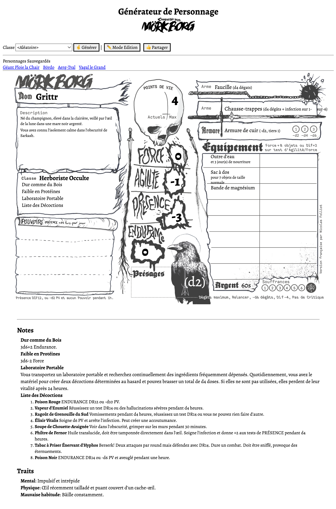

# MÖRK BORG - Character Generator

A character generator for the <a href="https://morkborg.com/" target="_blank">MÖRK BORG</a> tabletop RPG in English, French and Portuguese (Brazil).
This generator runs in a browser in pure HTML, CSS and Javascript.

## Usage

1. Launch the <a href="https://fxnicolas.github.io/mork-borg-character-generator/mork-borg-character-generator.html" target="_blank">generator</a>
2. Select a character **Class**, then click **Generate**. You can also choose a random class or no class (Scum), by selecting two excellence attributes (rolled on the 3 best of 4d6 instead of 3d6).
3. **Edit Mode** allows you to modify the content of the sheet (click on an element to edit it) and save your characters locally.
4. You can directly print the sheet to PDF or on paper (A4, Landscape orientation).  *Note that the header and footer will automatically be hidden when printing*.

## Credits

The Portuguese (Brazil) translation is provided by <a href="https://github.com/SoJaum" target="blank">Jaum</a>.

## Notice

This character generation for MÖRK BORG is an independent production by FX Nicolas and is not affiliated with Ockult Örtmästare Games or Stockholm Kartell. It is published under the MÖRK BORG Third Party License.
MÖRK BORG is copyright Ockult Örtmästare Games and Stockholm Kartell.  
This tools is based on (forked from) the <b>Waste of Skin</b> generator by <a href="https://github.com/AlessandroMinali/mork-borg-gen" target="_blank">Alessandro Minali</a>, available under the MIT license..

